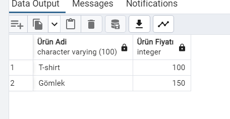
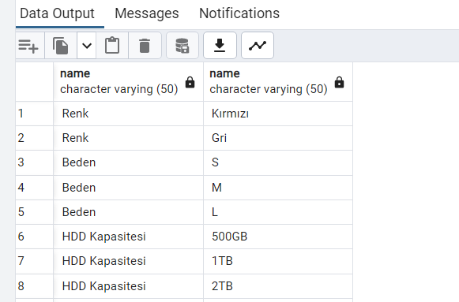
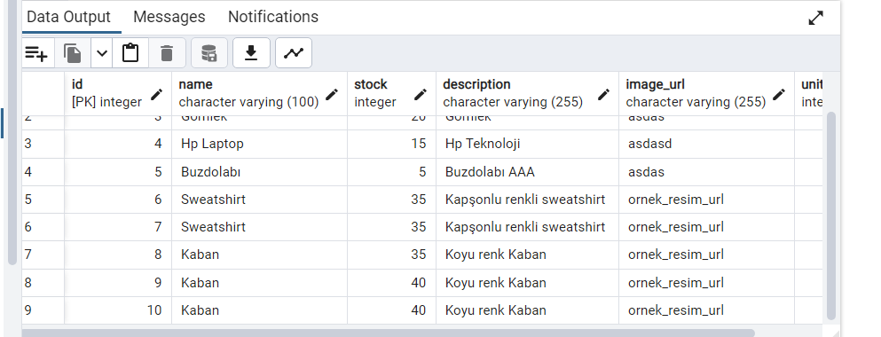
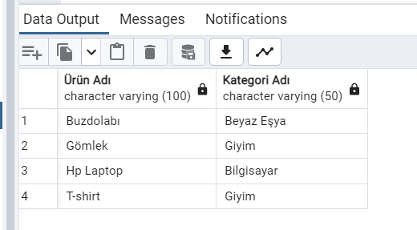
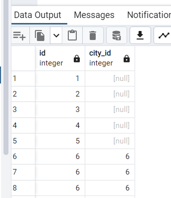
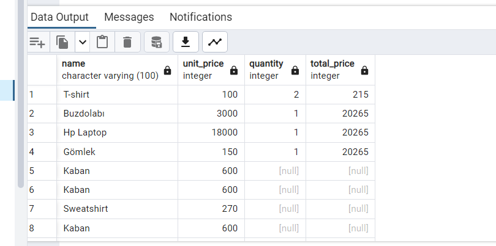
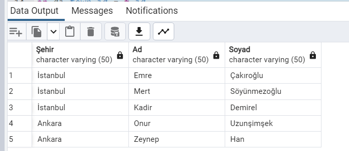

### ⚡ Inner Join 

```
SELECT * FROM product_categories pc 
inner join products p 
on pc.product_id=p.id
inner join categories c
on pc.category_id=c.id
```

### ⚡ Left Join

```
SELECT * FROM cities ci
left join towns t
on ci.id=t.city_id
```
### ⚡ Between Command

```
SELECT name as "Ürün Adi",unit_price as "Ürün Fiyatı" FROM products
where unit_price BETWEEN 100 AND 200
```
### ⚡ Right Join

```
select pc.name, pcv.name from product_chars pc
right join product_char_values pcv
on pc.id = pcv.product_char_id
```

### ⚡ Insert Command

```
insert into products(name, stock, description, image_url, unit_price) 
values ('Kaban', 40 , 'Koyu renk Kaban', 'ornek_resim_url', 600)
```

### ⚡ Group By Command

```
select p.name as "Ürün Adı", c.name as "Kategori Adı"
from product_categories pc
inner join products p
on pc.product_id = p.id
inner join categories c
on pc.category_id = c.id
group by p.name, c.name
```
###  ⚡ Left Join

```
select ci.id, t.city_id from cities ci
left join towns t
on ci.id=t.city_id
```
###  ⚡ Full Outher Join Command

```
select p.name, p.unit_price, bi.quantity, b.total_price from basket_items bi
full outer join baskets b
on bi.basket_id = b.id
full outer join products p
on bi.product_id = p.id
```
### ⚡ In Commands

```
select ci.name as "Şehir", ic.first_name as "Ad", ic.last_name as "Soyad"
from individual_customers ic
inner join customers c
on ic.id = c.id
inner join users us
on c.id = us.id
inner join addresses ad
on ad.user_id = us.id
inner join streets st
on ad.street_id = st.id
inner join districts di
on st.district_id = di.id
inner join towns t
on di.town_id = t.id
inner join cities ci
on t.city_id = ci.id
where ci.name in ('Ankara', 'İstanbul')
```


