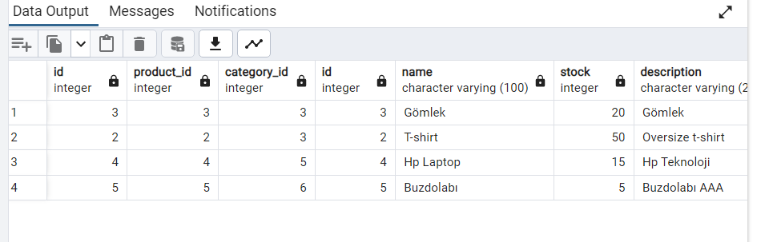
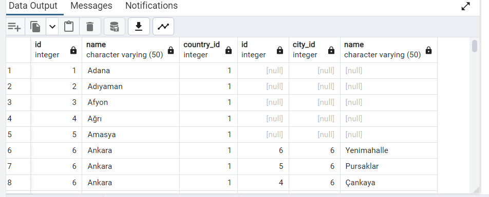

### ⚡ Inner Join 

```
SELECT * FROM product_categories pc 
inner join products p 
on pc.product_id=p.id
inner join categories c
on pc.category_id=c.id
```

### ⚡ Left Join

```
SELECT * FROM cities ci
left join towns t
on ci.id=t.city_id
```